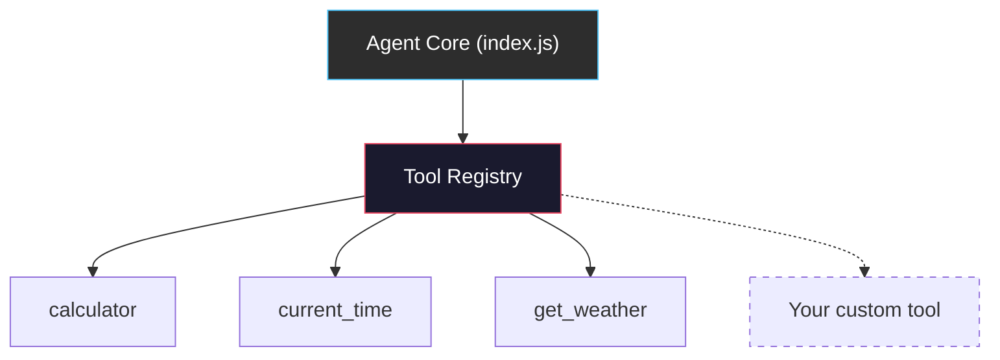
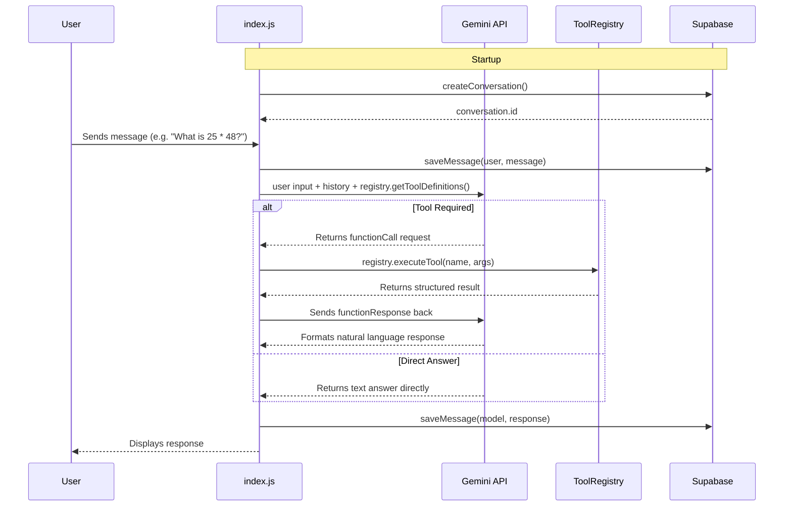
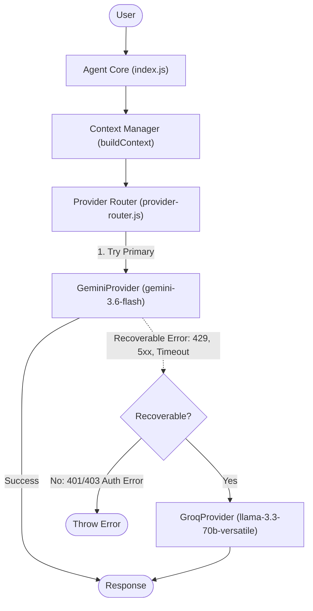

# AI Agent Practice — Atlas AI

A modular, production-style AI agent built from scratch using **Node.js**, **Google Gemini API**, and **Supabase**. This repository is an incremental learning and practice project demonstrating core AI agent concepts—such as context management, autonomous tool calling, rate-limit resilience, persistent memory, a pluggable tool registry, and smart token management—without relying on heavy agent frameworks.

---

## 🚀 Project Overview

**Atlas AI** is designed to demonstrate how autonomous AI agents operate under the hood:
1. **Natural Language Understanding & Persona:** Uses system instructions to define a consistent, honest AI identity ("Atlas").
2. **Context & Memory Management:** Implements sliding-window conversation history to maintain multi-turn context while keeping token consumption optimized.
3. **Autonomous Function/Tool Calling:** Uses a pluggable tool registry to expose functions to Gemini, letting the LLM decide when and how to invoke tools.
4. **Resilience & Rate-Limit Hardening:** Employs exponential backoff retries for API rate limits (`HTTP 429`) and sanitizes all errors so API keys and secrets are never leaked.
5. **Database Integration Layer:** Integrates Supabase as the foundation for persistent chat history and agent memory.
6. **Persistent Conversation Memory:** Saves every conversation and message to Supabase, enabling cross-session history retrieval with configurable limits.
7. **Domain-Agnostic Tool Registry:** Tools can be registered, validated, executed, and swapped without modifying the agent core.

---

## ✨ Features Currently Implemented

- **Interactive CLI Interface:** Multi-turn conversation loop in the terminal.
- **Sliding-Window Memory:** Configurable history window (`MAX_TURNS`) to preserve context efficiently.
- **AI Provider Abstraction & Automatic Failover (Phase 5.5):**
  - Decoupled provider layer isolating provider-specific SDK logic behind a common interface.
  - **Primary Provider:** Google Gemini (`gemini-3.6-flash`).
  - **Fallback Provider:** Groq (`llama-3.3-70b-versatile` via official `groq-sdk`).
  - **Automatic Failover:** Automatically catches recoverable failures (`429` rate limits, quota exhaustion, `5xx` server errors, timeouts, network issues) and attempts Groq.
  - **Zero Waste:** Groq is **never called** when Gemini succeeds.
  - **Permanent Error Shield:** Non-recoverable errors (such as invalid credentials `401`/`403`) throw immediately without futile fallback.
  - **Tool Calling Parity:** Both Gemini and Groq support local function execution through the `ToolRegistry`.
  - **Observability:** Structured logs (`provider=gemini status=failed reason=rate_limit`, `provider=groq status=success fallback=true`) with automatic secret masking.
  - **Zero-Quota Provider Tests:** 48 mock unit tests covering all failover edge cases without spending API credits.
- **Pluggable Tool Registry (Phase 4C):**
  - Domain-agnostic `ToolRegistry` class with `register()`, `unregister()`, `executeTool()`, `validateToolArguments()`, `getToolDefinitions()`, and `getOpenAIToolDefinitions()`.
  - Agent core has zero knowledge of specific tools — fully decoupled.
  - Tools can be added, replaced, or removed at runtime without touching `index.js`.
  - Default tools: `calculator`, `current_time`, `get_weather`.
- **Smart Context & Token Management (Phase 5):**
  - **Context Budget:** Dynamically estimates token usage to stay within `MAX_CONTEXT_TOKENS`.
  - **Deduplication:** Automatically removes duplicated messages to save tokens.
  - **Payload Truncation:** Large tool results are truncated with metadata warnings to prevent blowing up the context window.
  - **Observability:** Logs context stats (messages considered/sent, estimated tokens, trimming status) per turn without exposing sensitive data.
- **Rate-Limit Protection & Exponential Backoff:** Automatically retries API calls on `429` status codes with increasing backoff delays (2s → 4s → 8s up to 30s).
- **Decoupled Local Testing Mode:** Suite of local tool unit tests that run with **zero API calls**, protecting your Gemini quota.
- **Supabase Foundation:** Verified client module with environment variable validation and health-check probe capabilities.
- **Persistent Conversation Memory (Phase 4B):**
  - Conversations and messages stored in Supabase PostgreSQL tables.
  - Automatic conversation creation on agent startup.
  - Non-blocking message persistence (user and model messages saved after each turn).
  - Configurable message retrieval with `LIMIT` to prevent unbounded history loading.
  - Graceful degradation: agent continues with in-memory history if Supabase is unavailable.
- **Security First:** Strict `.env` isolation, secret masking in error logs, and RLS policies on database tables.

---

## 🛠 Tech Stack

- **Runtime:** Node.js (ES Modules)
- **Primary AI SDK:** `@google/genai` (Gemini API — `gemini-3.6-flash`)
- **Fallback AI SDK:** `groq-sdk` (Groq API — `llama-3.3-70b-versatile`)
- **Database:** Supabase (`@supabase/supabase-js`)
- **Configuration:** `dotenv`

---

## 📂 Project Structure

```text
ai-agent-practice/
├── .env.example              # Template for environment variables (Gemini, Groq, Supabase)
├── .gitignore                # Git exclusion rules (node_modules, .env)
├── config.js                 # Shared settings (models, providers, retry/memory limits)
├── index.js                  # Main CLI entry point — domain-agnostic agent core
├── package.json              # Node.js dependencies and run scripts
├── schema.sql                # SQL schema for Supabase (health_check, conversations, messages)
├── supabase.js               # Supabase client, connection probe, and persistence functions
├── context-manager.js        # Smart history selection, token budgeting, and truncation
├── tool-registry.js          # ToolRegistry class with Gemini and OpenAI tool definitions
├── tools.js                  # Default tool registrations (calculator, time, weather)
├── providers/                # AI Provider Abstraction Layer (Phase 5.5)
│   ├── gemini-provider.js    # Primary provider implementation (@google/genai)
│   ├── groq-provider.js      # Fallback provider implementation (groq-sdk)
│   └── provider-router.js    # Failover orchestrator, error classifier, observability
├── test.js                   # Dual-mode test runner (local tool tests + API integration tests)
├── test-context.js           # Context manager unit tests (trimming, tokens, truncation)
├── test-registry.js          # Tool registry unit tests (registration, execution, validation)
├── test-providers.js         # Provider abstraction & failover tests (mocked, 0 API quota)
├── test-supabase-memory.js   # Supabase persistent memory integration tests
└── apply-schema.js           # Schema status checker for Supabase
```

---

## 🔌 Tool Registry (Phase 4C)

The agent uses a **domain-agnostic Tool Registry** that decouples the agent core from specific tool implementations.

### Architecture



### Registry API

| Method | Description |
|--------|-------------|
| `register({ name, description, parameters, execute })` | Add a tool (chainable) |
| `unregister(name)` | Remove a tool by name |
| `has(name)` | Check if a tool exists |
| `listTools()` | List all registered tool names |
| `getTool(name)` | Get full tool config |
| `getToolDefinitions()` | Get Gemini-compatible declarations |
| `executeTool(name, args)` | Execute a tool safely |
| `validateToolArguments(name, args)` | Check required args |
| `clear()` | Remove all tools |
| `size` | Number of registered tools |

### How to Add a New Tool

Adding a new tool requires **zero changes** to the agent core (`index.js`). Just register it in `tools.js`:

```javascript
// In tools.js — add this after the existing registrations:

registry.register({
  name: "search_faculty",
  description: "Search for a faculty member by name or department.",
  parameters: {
    type: "object",
    properties: {
      query: {
        type: "string",
        description: "Faculty name or department to search",
      },
    },
    required: ["query"],
  },
  execute(args) {
    const { query } = args;
    // Your implementation here — database lookup, API call, etc.
    return { name: "Dr. Smith", department: query, office: "Room 204" };
  },
});
```

That's it. Gemini will automatically discover the new tool and use it when appropriate.

### Swapping Tools for a Different Project

For a completely different project (e.g., an e-commerce bot), create a new tools file:

```javascript
// tools-ecommerce.js
import { ToolRegistry } from "./tool-registry.js";
export const registry = new ToolRegistry();

registry.register({
  name: "search_products",
  description: "Search the product catalog.",
  parameters: { type: "object", properties: { query: { type: "string" } }, required: ["query"] },
  execute: (args) => { /* ... */ },
});

registry.register({
  name: "get_order",
  description: "Look up an order by ID.",
  parameters: { type: "object", properties: { orderId: { type: "string" } }, required: ["orderId"] },
  execute: (args) => { /* ... */ },
});
```

Then change the import in `index.js`:
```javascript
// Change this one line:
import { registry } from "./tools-ecommerce.js";
```

The agent core, Supabase persistence, memory management, and retry logic all remain untouched.

---

## 🧠 Token and Context Management (Phase 5)

To ensure Atlas AI runs efficiently and stays within API token limits (especially for high-volume hackathon usage), it employs a **deterministic context manager**.

1. **Context Budget:** `MAX_CONTEXT_TOKENS` ensures we never send the entire conversation history. The agent dynamically estimates the size of each message (using a fast `length / 4` heuristic).
2. **Prioritizing the Present:** It iterates *backwards* through the history, ensuring the most recent messages (and the latest user prompt) are always included first. If the budget is exhausted, older messages are dropped.
3. **Payload Truncation:** If a tool returns a massive JSON object (e.g. 500 records), `context-manager.js` safely truncates the payload to `MAX_TOOL_PAYLOAD_SIZE` and adds a `_meta` flag letting Gemini know the data was truncated. This prevents single API calls from blowing the token budget.
4. **Deduplication:** It filters out exact consecutive duplicate messages to save space.
5. **Observability:** Every request prints a clean status line:
   `📊 Context: 5/10 msgs | ~400 tokens | Trimmed: Yes | Tools: 1`
   This provides full visibility into API consumption without logging API keys or sensitive message contents.

---

## 🗃 Database Schema (Phase 4B)

Atlas AI uses two Supabase tables for persistent conversation memory:

### `conversations`
| Column       | Type                          | Description                       |
|-------------|-------------------------------|-----------------------------------|
| `id`        | `uuid` (PK, auto-generated)  | Unique conversation identifier    |
| `title`     | `text`                        | Human-readable session title      |
| `created_at`| `timestamptz`                 | When the conversation started     |
| `updated_at`| `timestamptz`                 | Last activity timestamp           |

### `messages`
| Column            | Type                          | Description                       |
|------------------|-------------------------------|-----------------------------------|
| `id`             | `uuid` (PK, auto-generated)  | Unique message identifier         |
| `conversation_id`| `uuid` (FK → conversations)  | Parent conversation               |
| `role`           | `text` (`user` or `model`)   | Who sent the message              |
| `content`        | `text`                        | Message text content              |
| `created_at`     | `timestamptz`                 | When the message was saved        |

**Index:** `idx_messages_conversation_created` on `(conversation_id, created_at)` for fast retrieval.

**RLS:** Development-mode policies allow full access via `anon` and `authenticated` roles. Authentication will be added in a later phase.

### Setup
Run the `schema.sql` file in your Supabase SQL Editor to create all tables, policies, and indexes.

---

## ⚙️ How the Agent Works



---

## 🔀 AI Provider Abstraction & Automatic Failover (Phase 5.5)

The agent features an enterprise-ready **AI Provider Abstraction Layer** with automatic failover between **Google Gemini (Primary)** and **Groq (Fallback)**.

### Failover Architecture



### Key Principles

1. **Gemini is Primary**: All requests attempt Gemini first by default.
2. **Groq is Fallback**: Groq is called **only** when Gemini encounters a recoverable provider error.
3. **Zero Waste**: Groq is **never called** when Gemini succeeds. No redundant API calls.
4. **Permanent Error Protection**: Non-recoverable errors (such as invalid API key `401` or permission denied `403`) throw immediately without futile fallback.
5. **Tool Registry Parity**: Both providers support tool calling (`calculator`, `current_time`, `get_weather`, and future tools) through `ToolRegistry`.
6. **Smart Context Integration**: Both providers respect the exact same token limits and payload truncations via `context-manager.js`. Neither provider receives unbounded conversation history.

### Error Classification Matrix

| Error Type | Status / Code | Action | Example Reason Logged |
| :--- | :--- | :--- | :--- |
| **Rate Limit / Quota** | `HTTP 429`, `RESOURCE_EXHAUSTED` | **Failover to Groq** | `reason=rate_limit` |
| **Request Timeout** | `ETIMEDOUT`, `UND_ERR_CONNECT_TIMEOUT` | **Failover to Groq** | `reason=timeout` |
| **Server Error** | `HTTP 500`, `502`, `503`, `504` | **Failover to Groq** | `reason=server_error` |
| **Network Failure** | `ECONNRESET`, `ECONNREFUSED` | **Failover to Groq** | `reason=network_error` |
| **Auth / Invalid Key** | `HTTP 401`, `HTTP 403` | **Do NOT Failover** (throws directly) | `reason=auth_error` |
| **Not Found** | `HTTP 404` | **Do NOT Failover** (throws directly) | `reason=not_found` |

### Switching Primary and Fallback

Atlas AI allows reversing or customizing the provider hierarchy directly through environment variables without modifying Agent Core code:

```bash
# In .env:
AI_PRIMARY_PROVIDER=groq
AI_FALLBACK_PROVIDER=gemini
```

### Observability & Logging

Lightweight, structured log events are emitted during routing without leaking sensitive credentials:

```text
# Normal successful turn:
[ProviderRouter] provider=gemini status=success

# Automatic failover upon rate limit:
[ProviderRouter] provider=gemini status=failed reason=rate_limit
[ProviderRouter] provider=groq status=attempting fallback=true
[ProviderRouter] provider=groq status=success fallback=true
```

---

## 📋 Environment Variables

Copy `.env.example` to `.env` and fill in your credentials:

```bash
cp .env.example .env
```

Define the following variables in `.env`:

```env
# AI Provider Configuration
AI_PRIMARY_PROVIDER=gemini
AI_FALLBACK_PROVIDER=groq

# Primary AI Provider — Gemini API Key (https://aistudio.google.com/apikey)
GEMINI_API_KEY=your_gemini_api_key

# Fallback AI Provider — Groq API Key (https://console.groq.com/keys)
GROQ_API_KEY=your_groq_api_key
GROQ_MODEL=llama-3.3-70b-versatile

# Supabase Credentials (https://supabase.com/dashboard -> Project Settings -> API)
SUPABASE_URL=your_supabase_url
SUPABASE_ANON_KEY=your_supabase_anon_key
```

> **Note:** `GROQ_API_KEY` is **optional** for normal Gemini operation. If Gemini succeeds, Groq is never initialized or called.
>
> **Security Warning:** Never commit `.env` or hardcode actual credentials into source code. `.env` is listed in `.gitignore`.

---

## 🏃 How to Run Locally

### 1. Install Dependencies
```bash
npm install
```

### 2. Set Up Database
Open the **Supabase SQL Editor** and run the contents of `schema.sql` to create all required tables.

### 3. Start Interactive Chat CLI
```bash
npm start
```
Type your prompt or question, and type `exit` when done. The agent will automatically create a conversation in Supabase and persist all messages.

---

## 🧪 Testing

### Run Local Tool Tests (Zero API Calls)
Validates calculator, time, weather mock, and edge cases locally without consuming Gemini API quota:
```bash
npm run test:local
```

### Run Tool Registry Tests (Zero API Calls)
Tests registration, discovery, execution, validation, unregister, replacement, Gemini definitions, and OpenAI tool format:
```bash
npm run test:registry
```

### Run Context Manager Tests (Zero API Calls)
Tests token estimation, payload truncation, message deduplication, and budget trimming:
```bash
npm run test:context
```

### Run Provider Abstraction & Failover Tests (Zero API Calls)
Validates all failover scenarios (429 rate limit, 5xx server errors, timeouts, auth errors, tool calling, and secret redaction) using mocked providers:
```bash
npm run test:providers
```

### Run Supabase Connection Test
Verifies environment variables and tests connectivity to Supabase:
```bash
npm run test:supabase
```

### Run Supabase Memory Tests (Zero Gemini API Calls)
Tests full CRUD lifecycle for conversations and messages against live Supabase:
```bash
npm run test:supabase-memory
```

### Run API Integration Tests (Consumes API Quota)
Runs full end-to-end test suite against Gemini API:
```bash
npm run test:api
```

### Run All Tests
```bash
npm test
```

---

## 📈 Development Roadmap & Progress

- [x] **Phase 1: Basic Gemini Chat** — Scaffold project, connect `@google/genai`, terminal chat loop.
- [x] **Phase 2: Agent Foundation & Memory** — System instructions, persona guidelines, sliding-window conversation memory.
- [x] **Phase 3: Autonomous Tool Calling** — Function declarations for `calculator`, `current_time`, and `get_weather`.
- [x] **Phase 3 Hardening: Resilience & Testing** — Exponential backoff for `429` rate limits, local test suite with 0 quota cost, error sanitization.
- [x] **Phase 4A: Supabase Foundation** — Supabase JS client integration, environment validation, health check probe.
- [x] **Phase 4B: Persistent Memory** — Store conversation sessions and messages in Supabase tables with CRUD functions, non-blocking persistence, and configurable retrieval limits.
- [x] **Phase 4C: Tool Registry** — Domain-agnostic ToolRegistry class with register/unregister/execute/validate. Agent core is fully decoupled from tool implementations.
- [x] **Phase 5: Smart Context + Token Management** — Token estimation, configurable context budgets, deduplication, payload truncation, and observability logging.
- [x] **Phase 5.5: AI Provider Abstraction + Gemini → Groq Failover** — Decoupled provider layer, automatic failover on recoverable errors (429, 5xx, timeouts), Groq fallback support, zero quota mock test suite.
- [ ] **Phase 6: Advanced Tooling & RAG** — Knowledge retrieval and multi-step tool execution pipelines.

---

## 🔒 Security Notes

- All errors caught during API requests mask sensitive strings like `GEMINI_API_KEY` and `GROQ_API_KEY` before printing to terminal output.
- Expression inputs to the calculator tool are sanitized against a whitelist regex to prevent code execution vulnerabilities.
- Supabase Row Level Security (RLS) policies are enforced on database tables.
- Persistence errors never crash the agent — they are caught and logged as warnings.
- Tool execution is wrapped in try/catch — a crashing tool never brings down the agent.

