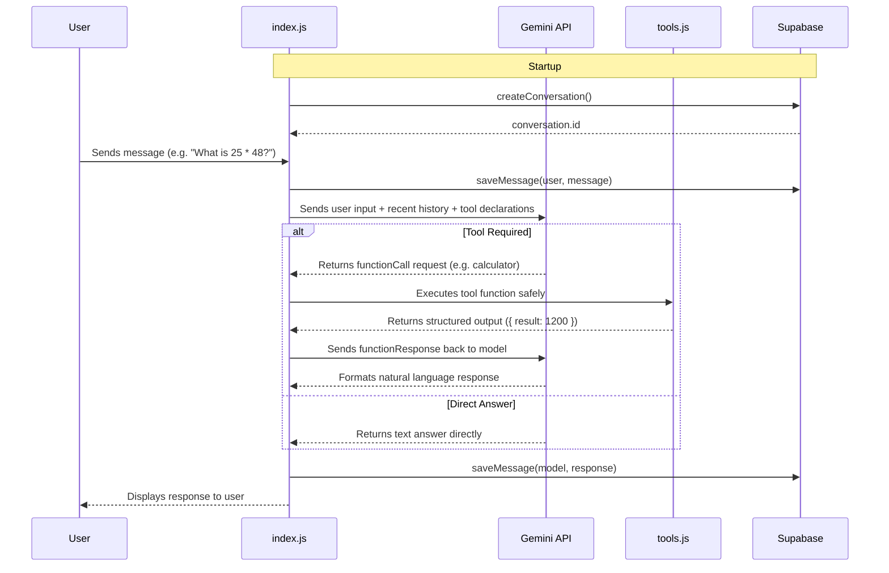

# AI Agent Practice — Atlas AI

A modular, production-style AI agent built from scratch using **Node.js**, **Google Gemini API**, and **Supabase**. This repository is an incremental learning and practice project demonstrating core AI agent concepts—such as context management, autonomous tool calling, rate-limit resilience, persistent memory, and database integration—without relying on heavy agent frameworks.

---

## 🚀 Project Overview

**Atlas AI** is designed to demonstrate how autonomous AI agents operate under the hood:
1. **Natural Language Understanding & Persona:** Uses system instructions to define a consistent, honest AI identity ("Atlas").
2. **Context & Memory Management:** Implements sliding-window conversation history to maintain multi-turn context while keeping token consumption optimized.
3. **Autonomous Function/Tool Calling:** Exposes local functions (`calculator`, `current_time`, `get_weather`) directly to Gemini via schema declarations, letting the LLM decide when and how to invoke tools.
4. **Resilience & Rate-Limit Hardening:** Employs exponential backoff retries for API rate limits (`HTTP 429`) and sanitizes all errors so API keys and secrets are never leaked.
5. **Database Integration Layer:** Integrates Supabase as the foundation for persistent chat history and agent memory.
6. **Persistent Conversation Memory:** Saves every conversation and message to Supabase, enabling cross-session history retrieval with configurable limits.

---

## ✨ Features Currently Implemented

- **Interactive CLI Interface:** Multi-turn conversation loop in the terminal.
- **Sliding-Window Memory:** Configurable history window (`MAX_TURNS`) to preserve context efficiently.
- **Autonomous Tool Calling:**
  - `calculator`: Evaluates arithmetic expressions safely with input sanitization.
  - `current_time`: Returns local system date and time.
  - `get_weather`: Returns mock/simulated weather data with explicit disclaimers.
- **Rate-Limit Protection & Exponential Backoff:** Automatically retries API calls on `429` status codes with increasing backoff delays (2s → 4s → 8s up to 30s).
- **Decoupled Local Testing Mode:** Suite of local tool unit tests that run with **zero API calls**, protecting your Gemini quota.
- **Supabase Foundation:** Verified client module with environment variable validation and health-check probe capabilities.
- **Persistent Conversation Memory (Phase 4B):**
  - Conversations and messages stored in Supabase PostgreSQL tables.
  - Automatic conversation creation on agent startup.
  - Non-blocking message persistence (user and model messages saved after each turn).
  - Configurable message retrieval with `LIMIT` to prevent unbounded history loading.
  - Graceful degradation: agent continues with in-memory history if Supabase is unavailable.
- **Security First:** Strict `.env` isolation, secret masking in error logs, and RLS policies on database tables.

---

## 🛠 Tech Stack

- **Runtime:** Node.js (ES Modules)
- **AI SDK:** `@google/genai` (Gemini API)
- **Model:** `gemini-3.6-flash`
- **Database:** Supabase (`@supabase/supabase-js`)
- **Configuration:** `dotenv`

---

## 📂 Project Structure

```text
ai-agent-practice/
├── .env.example              # Template for environment variables
├── .gitignore                # Git exclusion rules (node_modules, .env)
├── config.js                 # Shared settings (model, system instructions, retry/memory limits)
├── index.js                  # Main CLI entry point & chat loop with tool call handler + persistence
├── package.json              # Node.js dependencies and run scripts
├── schema.sql                # SQL schema for Supabase (health_check, conversations, messages)
├── supabase.js               # Supabase client, connection probe, and persistence functions
├── test.js                   # Dual-mode test runner (local tool tests + API integration tests)
├── test-supabase-memory.js   # Supabase persistent memory integration tests
└── tools.js                  # Tool declarations, implementations, and safe executor
```

---

## 🗃 Database Schema (Phase 4B)

Atlas AI uses two Supabase tables for persistent conversation memory:

### `conversations`
| Column       | Type                          | Description                       |
|-------------|-------------------------------|-----------------------------------|
| `id`        | `uuid` (PK, auto-generated)  | Unique conversation identifier    |
| `title`     | `text`                        | Human-readable session title      |
| `created_at`| `timestamptz`                 | When the conversation started     |
| `updated_at`| `timestamptz`                 | Last activity timestamp           |

### `messages`
| Column            | Type                          | Description                       |
|------------------|-------------------------------|-----------------------------------|
| `id`             | `uuid` (PK, auto-generated)  | Unique message identifier         |
| `conversation_id`| `uuid` (FK → conversations)  | Parent conversation               |
| `role`           | `text` (`user` or `model`)   | Who sent the message              |
| `content`        | `text`                        | Message text content              |
| `created_at`     | `timestamptz`                 | When the message was saved        |

**Index:** `idx_messages_conversation_created` on `(conversation_id, created_at)` for fast retrieval.

**RLS:** Development-mode policies allow full access via `anon` and `authenticated` roles. Authentication will be added in a later phase.

### Setup
Run the `schema.sql` file in your Supabase SQL Editor to create all tables, policies, and indexes.

---

## ⚙️ How the Agent Works



---

## 📋 Environment Variables

Copy `.env.example` to `.env` and fill in your credentials:

```bash
cp .env.example .env
```

Define the following variables in `.env`:

```env
# Gemini API Key (https://aistudio.google.com/apikey)
GEMINI_API_KEY=your_gemini_api_key

# Supabase Credentials (https://supabase.com/dashboard -> Project Settings -> API)
SUPABASE_URL=your_supabase_url
SUPABASE_ANON_KEY=your_supabase_anon_key
```

> **Security Warning:** Never commit `.env` or hardcode actual credentials into source code. `.env` is listed in `.gitignore`.

---

## 🏃 How to Run Locally

### 1. Install Dependencies
```bash
npm install
```

### 2. Set Up Database
Open the **Supabase SQL Editor** and run the contents of `schema.sql` to create all required tables.

### 3. Start Interactive Chat CLI
```bash
npm start
```
Type your prompt or question, and type `exit` when done. The agent will automatically create a conversation in Supabase and persist all messages.

---

## 🧪 Testing

### Run Local Tool Tests (Zero API Calls)
Validates calculator, time, weather mock, and edge cases locally without consuming Gemini API quota:
```bash
npm run test:local
```

### Run Supabase Connection Test
Verifies environment variables and tests connectivity to Supabase:
```bash
npm run test:supabase
```

### Run Supabase Memory Tests (Zero Gemini API Calls)
Tests full CRUD lifecycle for conversations and messages against live Supabase:
```bash
npm run test:supabase-memory
```

### Run API Integration Tests (Consumes API Quota)
Runs full end-to-end test suite against Gemini API:
```bash
npm run test:api
```

### Run All Tests
```bash
npm test
```

---

## 📈 Development Roadmap & Progress

- [x] **Phase 1: Basic Gemini Chat** — Scaffold project, connect `@google/genai`, terminal chat loop.
- [x] **Phase 2: Agent Foundation & Memory** — System instructions, persona guidelines, sliding-window conversation memory.
- [x] **Phase 3: Autonomous Tool Calling** — Function declarations for `calculator`, `current_time`, and `get_weather`.
- [x] **Phase 3 Hardening: Resilience & Testing** — Exponential backoff for `429` rate limits, local test suite with 0 quota cost, error sanitization.
- [x] **Phase 4A: Supabase Foundation** — Supabase JS client integration, environment validation, health check probe.
- [x] **Phase 4B: Persistent Memory** — Store conversation sessions and messages in Supabase tables with CRUD functions, non-blocking persistence, and configurable retrieval limits.
- [ ] **Phase 5: Advanced Tooling & RAG** — Knowledge retrieval and multi-step tool execution pipelines.

---

## 🔒 Security Notes

- All errors caught during API requests mask sensitive strings like `GEMINI_API_KEY` before printing to terminal output.
- Expression inputs to the calculator tool are sanitized against a whitelist regex to prevent code execution vulnerabilities.
- Supabase Row Level Security (RLS) policies are enforced on database tables.
- Persistence errors never crash the agent — they are caught and logged as warnings.
