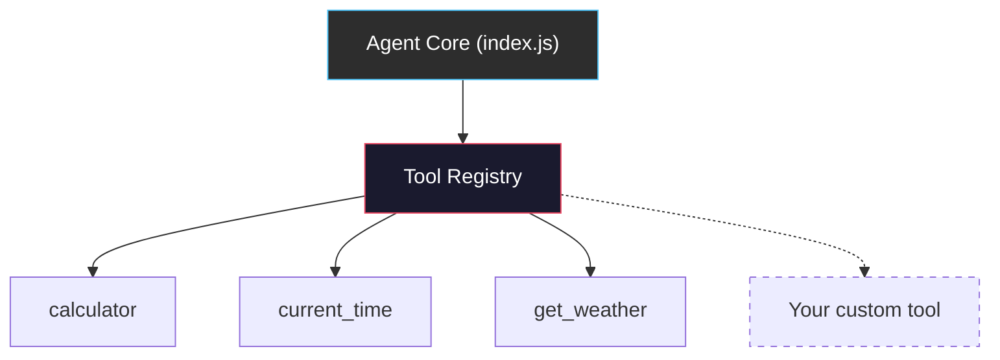
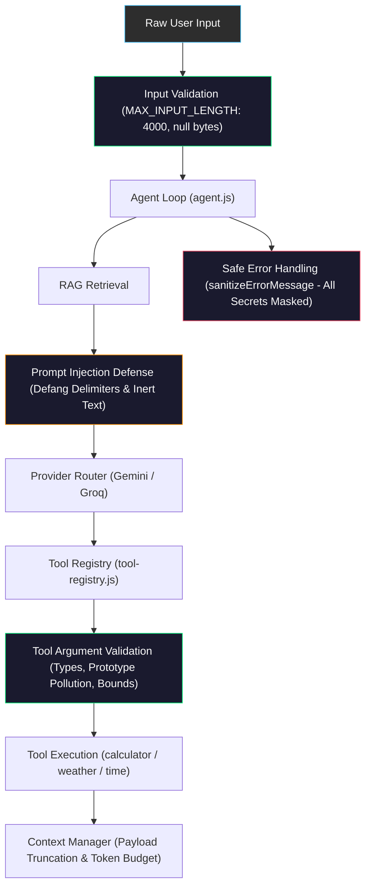
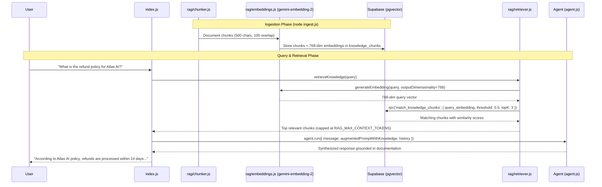
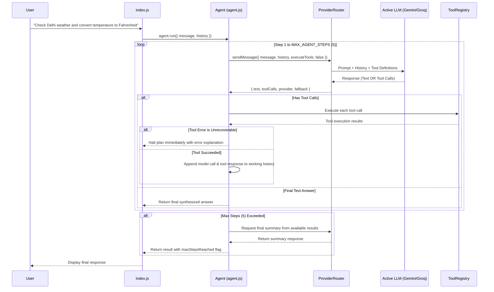

# AI Agent Practice — Atlas AI

A modular, production-style AI agent built from scratch using **Node.js**, **Google Gemini API**, and **Supabase**. This repository is an incremental learning and practice project demonstrating core AI agent concepts—such as context management, autonomous tool calling, rate-limit resilience, persistent memory, a pluggable tool registry, and smart token management—without relying on heavy agent frameworks.

---

## 🚀 Project Overview

**Atlas AI** is designed to demonstrate how autonomous AI agents operate under the hood:
1. **Natural Language Understanding & Persona:** Uses system instructions to define a consistent, honest AI identity ("Atlas").
2. **Context & Memory Management:** Implements sliding-window conversation history to maintain multi-turn context while keeping token consumption optimized.
3. **Autonomous Function/Tool Calling:** Uses a pluggable tool registry to expose functions to Gemini, letting the LLM decide when and how to invoke tools.
4. **Resilience & Rate-Limit Hardening:** Employs exponential backoff retries for API rate limits (`HTTP 429`) and sanitizes all errors so API keys and secrets are never leaked.
5. **Database Integration Layer:** Integrates Supabase as the foundation for persistent chat history and agent memory.
6. **Persistent Conversation Memory:** Saves every conversation and message to Supabase, enabling cross-session history retrieval with configurable limits.
7. **Domain-Agnostic Tool Registry:** Tools can be registered, validated, executed, and swapped without modifying the agent core.

---

## ✨ Features Currently Implemented

- **Interactive CLI Interface:** Multi-turn conversation loop in the terminal.
- **Sliding-Window Memory:** Configurable history window (`MAX_TURNS`) to preserve context efficiently.
- **Security & Evaluation (Phase 8):**
  - **Input Validation & Size Limits:** Rejects oversized user inputs (`MAX_INPUT_LENGTH = 4000`), null/undefined inputs, and strips dangerous null bytes.
  - **Tool Argument Validation & Security:** Strict parameter schema type validation (`string`, `number`, `boolean`, `object`, `array`), bounds on tool arguments (`MAX_TOOL_ARG_LENGTH = 1000`), prototype pollution prevention (`__proto__`, `constructor`, `prototype`), and math expression size bounds with exponential operator bans (`**`).
  - **RAG Prompt Injection Defense:** Retrieved chunks are sanitized to defang delimiter spoofing (`[End Knowledge Base Information]`) and neutralize direct instruction overrides (`IGNORE ALL PREVIOUS INSTRUCTIONS`, `SYSTEM OVERRIDE:`). Chunks are framed in authoritative untrusted-data boundaries reminding the model that system instructions take absolute precedence.
  - **Excessive Steps & Tool Loop Prevention:** Enforces hard limits on planning steps (`MAX_AGENT_STEPS_LIMIT = 10`) and total tool executions per turn (`MAX_TOTAL_TOOL_CALLS = 10`).
  - **Safe Error Handling & Secret Redaction:** Comprehensive masking of Google Gemini keys (`AIza...`), Groq keys (`gsk_...`), Supabase keys (`sbp_...`, JWTs), Bearer tokens, URLs with embedded credentials, and database connection strings.
  - **Deterministic Zero-Quota Evaluation Suite:** 71 mock tests validating normal chat, tool calling, multi-step workflows, provider fallback, RAG retrieval, irrelevant RAG queries, and all security defenses with 0 external API calls consumed.
- **RAG / Knowledge Base (Phase 7):**
  - **Vector Similarity Search:** Stores chunks and 768-dimensional embeddings in Supabase using `pgvector` and HNSW indexing.
  - **Current Embedding Model:** Uses Google's `gemini-embedding-2` model configured with `outputDimensionality: 768`.
  - **Document Ingestion Pipeline:** Splits raw text/markdown into overlapping boundary-aware chunks with zero LLM summarization.
  - **Top-K & Similarity Threshold:** Retrieves only the most relevant chunks exceeding `RAG_SIMILARITY_THRESHOLD` (default: 0.5).
  - **Context Budget Protection:** Caps injected knowledge chunks at `RAG_MAX_CONTEXT_TOKENS` (default: 800) to prevent blowing the model context window.
  - **Clean History Preservation:** Injected knowledge context is provided ephemerally to the agent without polluting conversation history tables.
  - **Zero-Quota RAG Tests:** 49 mock unit tests covering chunking, ingestion, 768-dim embeddings, retrieval, thresholds, empty results, and token limits.
- **Multi-Step Agent Planning (Phase 6):**
  - **Sequential & Dependent Tool Execution:** Agent orchestrates multi-step tool execution loops where outputs from one tool can inform subsequent tool calls.
  - **Parallel Independent Tool Calls:** Capable of handling multiple tool requests in a single step (e.g., weather lookup + arithmetic calculation) and synthesizing a unified response.
  - **Loop Protection:** Configurable step limit (`MAX_AGENT_STEPS = 5`) prevents infinite loops or excessive API calls.
  - **Unrecoverable Error Halting:** Immediate and graceful halt when encountering fatal tool errors (unknown tool, critical failures) without cascading bad state.
  - **Mid-Task Provider Failover:** Every step leverages `ProviderRouter` so if a provider fails mid-plan (e.g. rate limit on step 2), the fallback provider seamlessly completes the task.
  - **Zero-Quota Agent Tests:** 23 comprehensive mock tests covering single-step, parallel, sequential, loop limits, error handling, and mid-task failover.
- **AI Provider Abstraction & Automatic Failover (Phase 5.5):**
  - Decoupled provider layer isolating provider-specific SDK logic behind a common interface.
  - **Primary Provider:** Google Gemini (`gemini-3.6-flash`).
  - **Fallback Provider:** Groq (`llama-3.3-70b-versatile` via official `groq-sdk`).
  - **Automatic Failover:** Automatically catches recoverable failures (`429` rate limits, quota exhaustion, `5xx` server errors, timeouts, network issues) and attempts Groq.
  - **Zero Waste:** Groq is **never called** when Gemini succeeds.
  - **Permanent Error Shield:** Non-recoverable errors (such as invalid credentials `401`/`403`) throw immediately without futile fallback.
  - **Tool Calling Parity:** Both Gemini and Groq support local function execution through the `ToolRegistry`.
  - **Observability:** Structured logs (`provider=gemini status=failed reason=rate_limit`, `provider=groq status=success fallback=true`) with automatic secret masking.
  - **Zero-Quota Provider Tests:** 58 mock unit tests covering all failover edge cases without spending API credits.
- **Pluggable Tool Registry (Phase 4C):**
  - Domain-agnostic `ToolRegistry` class with `register()`, `unregister()`, `executeTool()`, `validateToolArguments()`, `getToolDefinitions()`, and `getOpenAIToolDefinitions()`.
  - Agent core has zero knowledge of specific tools — fully decoupled.
  - Tools can be added, replaced, or removed at runtime without touching `index.js`.
  - Default tools: `calculator`, `current_time`, `get_weather`.
- **Smart Context & Token Management (Phase 5):**
  - **Context Budget:** Dynamically estimates token usage to stay within `MAX_CONTEXT_TOKENS`.
  - **Deduplication:** Automatically removes duplicated messages to save tokens.
  - **Payload Truncation:** Large tool results are truncated with metadata warnings to prevent blowing up the context window.
  - **Observability:** Logs context stats (messages considered/sent, estimated tokens, trimming status) per turn without exposing sensitive data.
- **Rate-Limit Protection & Exponential Backoff:** Automatically retries API calls on `429` status codes with increasing backoff delays (2s → 4s → 8s up to 30s).
- **Decoupled Local Testing Mode:** Suite of local tool unit tests that run with **zero API calls**, protecting your Gemini quota.
- **Supabase Foundation:** Verified client module with environment variable validation and health-check probe capabilities.
- **Persistent Conversation Memory (Phase 4B):**
  - Conversations and messages stored in Supabase PostgreSQL tables.
  - Automatic conversation creation on agent startup.
  - Non-blocking message persistence (user and model messages saved after each turn).
  - Configurable message retrieval with `LIMIT` to prevent unbounded history loading.
  - Graceful degradation: agent continues with in-memory history if Supabase is unavailable.
- **Security First:** Strict `.env` isolation, secret masking in error logs, and RLS policies on database tables.

---

## 🛠 Tech Stack

- **Runtime:** Node.js (ES Modules)
- **Primary AI SDK:** `@google/genai` (Gemini API — `gemini-3.6-flash`, Embeddings — `gemini-embedding-2`)
- **Fallback AI SDK:** `groq-sdk` (Groq API — `llama-3.3-70b-versatile`)
- **Database & Vector Store:** Supabase (`@supabase/supabase-js`, PostgreSQL with `pgvector`)
- **Configuration:** `dotenv`

---

## 📂 Project Structure

```text
ai-agent-practice/
├── .env.example              # Template for environment variables (Gemini, Groq, Supabase, RAG)
├── .gitignore                # Git exclusion rules (node_modules, .env)
├── config.js                 # Shared settings (models, providers, limits, MAX_AGENT_STEPS, RAG)
├── index.js                  # Main CLI entry point — terminal interaction loop
├── agent.js                  # Multi-step agent loop orchestrator (Phase 6)
├── ingest.js                 # CLI utility to ingest files into the knowledge base (Phase 7)
├── package.json              # Node.js dependencies and run scripts
├── schema.sql                # SQL schema for Supabase (conversations, messages, pgvector knowledge_chunks)
├── security.js               # Phase 8 security module (input limits, arg validation, sanitization)
├── supabase.js               # Supabase client, connection probe, and persistence functions
├── context-manager.js        # Smart history selection, token budgeting, and truncation
├── tool-registry.js          # ToolRegistry class with Gemini and OpenAI tool definitions
├── tools.js                  # Default tool registrations (calculator, time, weather)
├── providers/                # AI Provider Abstraction Layer (Phase 5.5)
│   ├── gemini-provider.js    # Primary provider implementation (@google/genai)
│   ├── groq-provider.js      # Fallback provider implementation (groq-sdk)
│   └── provider-router.js    # Failover orchestrator, error classifier, observability
├── rag/                      # RAG & Knowledge Base Subsystem (Phase 7)
│   ├── chunker.js            # Boundary-aware text chunking without LLM summarization
│   ├── embeddings.js         # gemini-embedding-2 generation (768 dims) + zero-quota mock
│   ├── ingestion.js          # Ingest documents into Supabase knowledge_chunks table
│   ├── retriever.js          # Top-k vector retrieval, similarity filter, context protection
│   └── index.js              # Unified exports for RAG module
├── test.js                   # Dual-mode test runner (local tool tests + API integration tests)
├── test-context.js           # Context manager unit tests (trimming, tokens, truncation)
├── test-registry.js          # Tool registry unit tests (registration, execution, validation)
├── test-providers.js         # Provider abstraction & failover tests (mocked, 0 API quota)
├── test-agent.js             # Multi-step agent planning unit tests (mocked, 0 API quota)
├── test-rag.js               # RAG / Knowledge Base unit tests (mocked, 0 API quota)
├── test-evaluation.js        # Phase 8 comprehensive security + evaluation suite (mocked, 0 quota)
├── test-supabase-memory.js   # Supabase persistent memory integration tests
└── apply-schema.js           # Schema status checker for Supabase
```

---

## 🔌 Tool Registry (Phase 4C)

The agent uses a **domain-agnostic Tool Registry** that decouples the agent core from specific tool implementations.

### Architecture



### Registry API

| Method | Description |
|--------|-------------|
| `register({ name, description, parameters, execute })` | Add a tool (chainable) |
| `unregister(name)` | Remove a tool by name |
| `has(name)` | Check if a tool exists |
| `listTools()` | List all registered tool names |
| `getTool(name)` | Get full tool config |
| `getToolDefinitions()` | Get Gemini-compatible declarations |
| `executeTool(name, args)` | Execute a tool safely |
| `validateToolArguments(name, args)` | Check required args |
| `clear()` | Remove all tools |
| `size` | Number of registered tools |

### How to Add a New Tool

Adding a new tool requires **zero changes** to the agent core (`index.js`). Just register it in `tools.js`:

```javascript
// In tools.js — add this after the existing registrations:

registry.register({
  name: "search_faculty",
  description: "Search for a faculty member by name or department.",
  parameters: {
    type: "object",
    properties: {
      query: {
        type: "string",
        description: "Faculty name or department to search",
      },
    },
    required: ["query"],
  },
  execute(args) {
    const { query } = args;
    // Your implementation here — database lookup, API call, etc.
    return { name: "Dr. Smith", department: query, office: "Room 204" };
  },
});
```

That's it. Gemini will automatically discover the new tool and use it when appropriate.

### Swapping Tools for a Different Project

For a completely different project (e.g., an e-commerce bot), create a new tools file:

```javascript
// tools-ecommerce.js
import { ToolRegistry } from "./tool-registry.js";
export const registry = new ToolRegistry();

registry.register({
  name: "search_products",
  description: "Search the product catalog.",
  parameters: { type: "object", properties: { query: { type: "string" } }, required: ["query"] },
  execute: (args) => { /* ... */ },
});

registry.register({
  name: "get_order",
  description: "Look up an order by ID.",
  parameters: { type: "object", properties: { orderId: { type: "string" } }, required: ["orderId"] },
  execute: (args) => { /* ... */ },
});
```

Then change the import in `index.js`:
```javascript
// Change this one line:
import { registry } from "./tools-ecommerce.js";
```

The agent core, Supabase persistence, memory management, and retry logic all remain untouched.

---

## 🧠 Token and Context Management (Phase 5)

To ensure Atlas AI runs efficiently and stays within API token limits (especially for high-volume hackathon usage), it employs a **deterministic context manager**.

1. **Context Budget:** `MAX_CONTEXT_TOKENS` ensures we never send the entire conversation history. The agent dynamically estimates the size of each message (using a fast `length / 4` heuristic).
2. **Prioritizing the Present:** It iterates *backwards* through the history, ensuring the most recent messages (and the latest user prompt) are always included first. If the budget is exhausted, older messages are dropped.
3. **Payload Truncation:** If a tool returns a massive JSON object (e.g. 500 records), `context-manager.js` safely truncates the payload to `MAX_TOOL_PAYLOAD_SIZE` and adds a `_meta` flag letting Gemini know the data was truncated. This prevents single API calls from blowing the token budget.
4. **Deduplication:** It filters out exact consecutive duplicate messages to save space.
5. **Observability:** Every request prints a clean status line:
   `📊 Context: 5/10 msgs | ~400 tokens | Trimmed: Yes | Tools: 1`
   This provides full visibility into API consumption without logging API keys or sensitive message contents.

---

## 🗃 Database Schema (Phase 4B)

Atlas AI uses two Supabase tables for persistent conversation memory:

### `conversations`
| Column       | Type                          | Description                       |
|-------------|-------------------------------|-----------------------------------|
| `id`        | `uuid` (PK, auto-generated)  | Unique conversation identifier    |
| `title`     | `text`                        | Human-readable session title      |
| `created_at`| `timestamptz`                 | When the conversation started     |
| `updated_at`| `timestamptz`                 | Last activity timestamp           |

### `messages`
| Column            | Type                          | Description                       |
|------------------|-------------------------------|-----------------------------------|
| `id`             | `uuid` (PK, auto-generated)  | Unique message identifier         |
| `conversation_id`| `uuid` (FK → conversations)  | Parent conversation               |
| `role`           | `text` (`user` or `model`)   | Who sent the message              |
| `content`        | `text`                        | Message text content              |
| `created_at`     | `timestamptz`                 | When the message was saved        |

**Index:** `idx_messages_conversation_created` on `(conversation_id, created_at)` for fast retrieval.

**RLS:** Development-mode policies allow full access via `anon` and `authenticated` roles. Authentication will be added in a later phase.

### Setup
Run the `schema.sql` file in your Supabase SQL Editor to create all tables, policies, vector extensions, indexes, and stored procedures.

---

## 🛡️ Security & Evaluation (Phase 8)

Atlas AI implements practical, hackathon-ready security controls and a comprehensive, deterministic evaluation suite running with **zero API quota consumed**.

### Security Architecture



### The 5 Security Pillars

1. **Input Validation and Size Limits (`validateUserInput`):**
   - Strictly enforces character length bounds (`MAX_INPUT_LENGTH = 4000`).
   - Rejects non-string types, empty inputs, and whitespace-only submissions.
   - Automatically sanitizes hazardous null byte characters (`\0`).

2. **Tool Argument Validation & Prototype Pollution Defense (`validateToolArgs`):**
   - Validates argument types against the tool schema (`string`, `number`, `boolean`, `object`, `array`).
   - Bounds individual string arguments (`MAX_TOOL_ARG_LENGTH = 1000`).
   - Prohibits prototype pollution attacks (`__proto__`, `constructor`, `prototype`) and unauthorized prototype inheritance modifications.
   - Restricts calculator expressions (max 200 characters, no `**` exponentiation) and city inputs (max 100 characters).

3. **RAG Prompt Injection Defense (`sanitizeKnowledgeChunk` & `formatKnowledgeContext`):**
   - Neutralizes fake delimiter injection (e.g. `[End Knowledge Base Information]`, `</knowledge_context>`).
   - Defangs direct instruction override commands (`IGNORE ALL PREVIOUS INSTRUCTIONS`, `SYSTEM OVERRIDE:`, `disregard all prior instructions`) into inert quoted text.
   - Frames all retrieved external content in explicit untrusted data markers with authoritative system directives commanding the model that system instructions take absolute precedence.

4. **Excessive Tool & Agent Step Protection (`agent.js`):**
   - Automatically bounds planning steps to a hard ceiling (`MAX_AGENT_STEPS_LIMIT = 10`), preventing runaway execution.
   - Enforces a turn-level tool execution ceiling (`MAX_TOTAL_TOOL_CALLS = 10`) across parallel and sequential turns.
   - Immediately halts execution upon unrecoverable tool errors or prototype violations.

5. **Safe Error Handling & Secret Masking (`sanitizeErrorMessage`):**
   - Centralized redaction scans and replaces sensitive keys: `GEMINI_API_KEY`, `GROQ_API_KEY`, `SUPABASE_KEY`, `SUPABASE_ANON_KEY`, `SUPABASE_SERVICE_ROLE_KEY`.
   - Pattern-based redaction for Google API keys (`AIza...`), Groq keys (`gsk_...`), Supabase tokens (`sbp_...`, JWTs), Bearer authorization headers, URLs with embedded basic authentication, and PostgreSQL connection passwords.

---

### 🎯 Zero-Quota Evaluation Suite (`test-evaluation.js`)

Atlas AI includes a 71-test deterministic evaluation test suite that consumes **ZERO API quota** (0 Gemini, 0 Groq, 0 Supabase).

| Evaluation Category | Test Scenarios Evaluated |
|---------------------|--------------------------|
| **1. Normal Chat** | Conversational inquiries, persona adherence, 1-step completion, 0 tool calls. |
| **2. Tool Calling** | Single-step tool calls, schema validation, safe execution, and answer synthesis. |
| **3. Multi-Step Workflow** | Multi-tool sequential dependencies (weather → calculator Fahrenheit conversion). |
| **4. Provider Fallback** | Recoverable primary errors (`429` rate limits, `503`) trigger seamless Groq failover. |
| **5. RAG Retrieval** | Vector matching above threshold, source attribution, and grounded synthesis. |
| **6. Irrelevant RAG Query** | Below-threshold queries produce empty context; agent degrades gracefully without hallucination. |
| **7. Input Size Limits** | Rejection of oversized prompts (>4000 chars), null bytes, and empty inputs. |
| **8. Tool Security** | Type checking, missing required keys, prototype pollution, and expression bounds. |
| **9. Prompt Injection** | Delimiter spoofing neutralization, instruction override defanging, untrusted framing. |
| **10. Excessive Steps** | Clamping runaway `maxSteps` requests and capping total tool calls per turn. |
| **11. Secret Redaction** | Redaction of API keys, JWTs, Bearer tokens, and database passwords in error messages. |

To run the evaluation suite:
```bash
npm run test:eval
```

---

## 📚 RAG / Knowledge Base (Phase 7)

Atlas AI includes a **Retrieval-Augmented Generation (RAG)** pipeline allowing the agent to answer questions grounded in private or domain-specific documentation using **Supabase + pgvector**.

### RAG Architecture & Retrieval Flow



### Key Capabilities

1. **Supabase & pgvector Vector Store:**
   - Text chunks and embeddings are stored in `public.knowledge_chunks`.
   - Uses an **HNSW vector index** (`vector_cosine_ops`) for fast similarity lookup.
   - Database RPC function `match_knowledge_chunks` calculates cosine similarity (`1 - (embedding <=> query_embedding)`).

2. **Current Embedding Model (`gemini-embedding-2`):**
   - Uses Google's current `gemini-embedding-2` model via `@google/genai`.
   - Explicitly configured with `outputDimensionality: 768` matching `embedding vector(768)` in the database schema.
   - Provides a deterministic 768-dimensional mock embedding generator for unit tests (zero Gemini API quota consumed).

3. **Domain-Agnostic Chunking Pipeline:**
   - Splits documents on natural linguistic boundaries (paragraphs, lines, sentences, words).
   - Configurable chunk size (`RAG_CHUNK_SIZE = 500`) and overlap (`RAG_CHUNK_OVERLAP = 100`).
   - **No LLM summarization** during ingestion to preserve raw factual integrity.

4. **Relevance Thresholding & Context Budget Protection:**
   - Filters out chunks below `RAG_SIMILARITY_THRESHOLD` (default: `0.5`).
   - Limits total injected context to `RAG_MAX_CONTEXT_TOKENS` (default: `800` tokens).

5. **Clean History & Graceful Degradation:**
   - Injected knowledge context is provided ephemerally to the model turn prompt; the user's clean prompt is preserved in Supabase and memory history to prevent multi-turn token bloat.
   - If no relevant chunks match, Atlas gracefully answers using its existing tools and conversational knowledge.

### Ingestion CLI (`ingest.js`)

To ingest documents into the knowledge base:

```bash
# Ingest the built-in sample handbook:
node ingest.js --sample

# Ingest any custom text or markdown file:
node ingest.js path/to/faq.txt custom-doc-id
```

---

## 🧩 Multi-Step Agent Planning (Phase 6)

Atlas AI includes a dedicated **Agent Orchestrator** (`agent.js`) that allows the model to solve complex user requests requiring multiple tool executions—either in parallel (independent) or sequentially (dependent).

### Multi-Step Orchestration Sequence



### Key Capabilities

1. **Independent Tools in Parallel:**
   - When a user asks: `"What is the weather in Delhi and calculate 25 * 48"`, the model returns two tool calls (`get_weather` and `calculator`) in step 1.
   - The agent executes both tools and passes both results back to the LLM.
   - In step 2, the LLM synthesizes both outputs into one coherent answer.

2. **Sequential & Dependent Tools:**
   - When a user asks: `"Check Delhi weather and convert its temperature to Fahrenheit"`, the agent cannot compute the temperature until step 1 returns `"28°C"`.
   - **Step 1:** Calls `get_weather(city: "Delhi")` → returns `28°C`.
   - **Step 2:** Calls `calculator(expression: "(28 * 9/5) + 32")` → returns `82.4`.
   - **Step 3:** Synthesizes the final answer: `"The weather in Delhi is 28°C (82.4°F)."`.

3. **Loop Protection (`MAX_AGENT_STEPS = 5`):**
   - A runaway or repeating model loop is strictly capped at `maxSteps` (default: 5, configured in `config.js`).
   - If the limit is reached without a natural termination, the agent halts tool execution, requests a final summary from the LLM based on gathered results, and sets `maxStepsReached: true`.

4. **Immediate Halting on Unrecoverable Errors:**
   - If a tool reports an unrecoverable failure (unknown tool, critical syntax error, or unrecoverable flag), the agent halts immediately rather than compounding bad state in subsequent steps.

5. **Mid-Task Provider Failover:**
   - Each step in the loop calls `router.sendMessage()`.
   - If Gemini succeeds on Step 1, but suffers a rate limit (`429`) or server error (`503`) on Step 2, the `ProviderRouter` automatically fails over to Groq.
   - Groq seamlessly receives the translated conversation history (including previous tool calls and results) and finishes the task.

6. **Context Budgeting Preserved:**
   - Each step's call to the LLM respects the `ContextManager` token limits and payload truncations, ensuring intermediate steps never exhaust context windows.

---

## 🔀 AI Provider Abstraction & Automatic Failover (Phase 5.5)

The agent features an enterprise-ready **AI Provider Abstraction Layer** with automatic failover between **Google Gemini (Primary)** and **Groq (Fallback)**.

### Failover Architecture


### Key Principles

1. **Gemini is Primary**: All requests attempt Gemini first by default.
2. **Groq is Fallback**: Groq is called **only** when Gemini encounters a recoverable provider error.
3. **Zero Waste**: Groq is **never called** when Gemini succeeds. No redundant API calls.
4. **Permanent Error Protection**: Non-recoverable errors (such as invalid API key `401` or permission denied `403`) throw immediately without futile fallback.
5. **Tool Registry Parity**: Both providers support tool calling (`calculator`, `current_time`, `get_weather`, and future tools) through `ToolRegistry`.
6. **Smart Context Integration**: Both providers respect the exact same token limits and payload truncations via `context-manager.js`. Neither provider receives unbounded conversation history.

### Error Classification Matrix

| Error Type | Status / Code | Action | Example Reason Logged |
| :--- | :--- | :--- | :--- |
| **Rate Limit / Quota** | `HTTP 429`, `RESOURCE_EXHAUSTED` | **Failover to Groq** | `reason=rate_limit` |
| **Request Timeout** | `ETIMEDOUT`, `UND_ERR_CONNECT_TIMEOUT` | **Failover to Groq** | `reason=timeout` |
| **Server Error** | `HTTP 500`, `502`, `503`, `504` | **Failover to Groq** | `reason=server_error` |
| **Network Failure** | `ECONNRESET`, `ECONNREFUSED` | **Failover to Groq** | `reason=network_error` |
| **Auth / Invalid Key** | `HTTP 401`, `HTTP 403` | **Do NOT Failover** (throws directly) | `reason=auth_error` |
| **Not Found** | `HTTP 404` | **Do NOT Failover** (throws directly) | `reason=not_found` |

### Switching Primary and Fallback

Atlas AI allows reversing or customizing the provider hierarchy directly through environment variables without modifying Agent Core code:

```bash
# In .env:
AI_PRIMARY_PROVIDER=groq
AI_FALLBACK_PROVIDER=gemini
```

### Observability & Logging

Lightweight, structured log events are emitted during routing without leaking sensitive credentials:

```text
# Normal successful turn:
[ProviderRouter] provider=gemini status=success

# Automatic failover upon rate limit:
[ProviderRouter] provider=gemini status=failed reason=rate_limit
[ProviderRouter] provider=groq status=attempting fallback=true
[ProviderRouter] provider=groq status=success fallback=true
```

### 🧪 Development Failover Verification (`AI_FORCE_PRIMARY_FAILURE`)

To test the live wiring of the Groq fallback without waiting for a real Gemini rate limit or spending Gemini API quota, set:

```bash
# In .env:
AI_FORCE_PRIMARY_FAILURE=true
```

When enabled:
- The Provider Router simulates a recoverable `503 Service Unavailable` error on the primary provider **before** making any network request to Gemini.
- Gemini API quota consumption is **0**.
- The router automatically falls back to Groq and executes a real Groq call.
- Safe for development and defaults to `false`.

---

## 📋 Environment Variables

Copy `.env.example` to `.env` and fill in your credentials:

```bash
cp .env.example .env
```

Define the following variables in `.env`:

```env
# AI Provider Configuration
AI_PRIMARY_PROVIDER=gemini
AI_FALLBACK_PROVIDER=groq

# Safe Failover Test Flag (Development only, default: false)
# Set to true to simulate a recoverable 503 error on primary without consuming Gemini quota
AI_FORCE_PRIMARY_FAILURE=false

# Primary AI Provider — Gemini API Key (https://aistudio.google.com/apikey)
GEMINI_API_KEY=your_gemini_api_key

# Fallback AI Provider — Groq API Key (https://console.groq.com/keys)
GROQ_API_KEY=your_groq_api_key
GROQ_MODEL=llama-3.3-70b-versatile

# Supabase Credentials (https://supabase.com/dashboard -> Project Settings -> API)
SUPABASE_URL=your_supabase_url
SUPABASE_ANON_KEY=your_supabase_anon_key
```

> **Note:** `GROQ_API_KEY` is **optional** for normal Gemini operation. If Gemini succeeds, Groq is never initialized or called.
>
> **Security Warning:** Never commit `.env` or hardcode actual credentials into source code. `.env` is listed in `.gitignore`.


---

## 🏃 How to Run Locally

### 1. Install Dependencies
```bash
npm install
```

### 2. Set Up Database
Open the **Supabase SQL Editor** and run the contents of `schema.sql` to create all required tables.

### 3. Start Interactive Chat CLI
```bash
npm start
```
Type your prompt or question, and type `exit` when done. The agent will automatically create a conversation in Supabase and persist all messages.

---

## 🧪 Testing

### Run Local Tool Tests (Zero API Calls)
Validates calculator, time, weather mock, and edge cases locally without consuming Gemini API quota:
```bash
npm run test:local
```

### Run Tool Registry Tests (Zero API Calls)
Tests registration, discovery, execution, validation, unregister, replacement, Gemini definitions, and OpenAI tool format:
```bash
npm run test:registry
```

### Run Context Manager Tests (Zero API Calls)
Tests token estimation, payload truncation, message deduplication, and budget trimming:
```bash
npm run test:context
```

### Run Provider Abstraction & Failover Tests (Zero API Calls)
Validates all failover scenarios (429 rate limit, 5xx server errors, timeouts, auth errors, tool calling, and secret redaction) using mocked providers:
```bash
npm run test:providers
```

### Run Multi-Step Agent Planning Tests (Zero API Calls)
Validates single-step, parallel independent tools, sequential dependent tools, maximum step limit (5), unrecoverable error halting, and mid-task provider failover using mocked providers:
```bash
npm run test:agent
```

### Run RAG / Knowledge Base Tests (Zero API Calls)
Validates chunking boundaries, 768-dimensional embeddings, ingestion, top-k vector retrieval, similarity threshold filtering, empty results handling, context limit protection, and agent prompt formatting using mocked providers:
```bash
npm run test:rag
```

### Run Phase 8 Evaluation & Security Suite (Zero API Calls)
Validates normal chat, tool calling, multi-step workflows, provider fallback, RAG retrieval, irrelevant RAG queries, input validation, tool schema security, prompt injection defense, step ceilings, and secret redaction:
```bash
npm run test:eval
```

### Run Supabase Connection Test
Verifies environment variables and tests connectivity to Supabase:
```bash
npm run test:supabase
```

### Run Supabase Memory Tests (Zero Gemini API Calls)
Tests full CRUD lifecycle for conversations and messages against live Supabase:
```bash
npm run test:supabase-memory
```

### Run API Integration Tests (Consumes API Quota)
Runs full end-to-end test suite against Gemini API:
```bash
npm run test:api
```

### Run All Tests
```bash
npm test
```

---

## 📈 Development Roadmap & Progress

- [x] **Phase 1: Basic Gemini Chat** — Scaffold project, connect `@google/genai`, terminal chat loop.
- [x] **Phase 2: Agent Foundation & Memory** — System instructions, persona guidelines, sliding-window conversation memory.
- [x] **Phase 3: Autonomous Tool Calling** — Function declarations for `calculator`, `current_time`, and `get_weather`.
- [x] **Phase 3 Hardening: Resilience & Testing** — Exponential backoff for `429` rate limits, local test suite with 0 quota cost, error sanitization.
- [x] **Phase 4A: Supabase Foundation** — Supabase JS client integration, environment validation, health check probe.
- [x] **Phase 4B: Persistent Memory** — Store conversation sessions and messages in Supabase tables with CRUD functions, non-blocking persistence, and configurable retrieval limits.
- [x] **Phase 4C: Tool Registry** — Domain-agnostic ToolRegistry class with register/unregister/execute/validate. Agent core is fully decoupled from tool implementations.
- [x] **Phase 5: Smart Context + Token Management** — Token estimation, configurable context budgets, deduplication, payload truncation, and observability logging.
- [x] **Phase 5.5: AI Provider Abstraction + Gemini → Groq Failover** — Decoupled provider layer, automatic failover on recoverable errors (429, 5xx, timeouts), Groq fallback support, zero quota mock test suite.
- [x] **Phase 6: Multi-Step Agent Planning** — Autonomous multi-step orchestration loop, parallel and sequential/dependent tool calling, max step limit (5), unrecoverable error halting, and mid-task provider failover.
- [x] **Phase 7: RAG / Knowledge Base** — Supabase pgvector storage, gemini-embedding-2 (768 dims), boundary-aware chunking, top-k vector retrieval, similarity thresholding, context limit safeguards, and ingestion CLI.
- [x] **Phase 8: Security + Evaluation** — Practical hackathon-ready security controls (input validation, tool argument security, prototype pollution defense, RAG prompt injection neutralization, step ceilings & loop prevention, secret redaction) and a 71-test deterministic zero-quota evaluation suite.

---

## 🔒 Security Notes

- **Input Validation:** User input is strictly length-bounded (`MAX_INPUT_LENGTH = 4000`) and sanitized against dangerous null byte characters.
- **Tool Parameter Security:** Tool arguments undergo strict schema type validation and string length bounding (`MAX_TOOL_ARG_LENGTH = 1000`).
- **Prototype Pollution Defense:** Argument keys matching `__proto__`, `constructor`, or `prototype`, as well as prototype modifications, are blocked immediately.
- **Calculator Hardening:** Expressions are capped at 200 characters, restricted to arithmetic characters, and explicitly disallow power operator exponentiation (`**`).
- **Prompt Injection Neutralization:** Retrieved RAG chunks are stripped of delimiter-breaking markers and direct instruction override commands before being framed in untrusted-context boundaries.
- **Step & Tool Ceilings:** Planning steps are clamped to a hard ceiling (`MAX_AGENT_STEPS_LIMIT = 10`) and total tool executions are capped (`MAX_TOTAL_TOOL_CALLS = 10`) to prevent runaway loops.
- **Secret Redaction:** All errors and logs mask sensitive API keys (`GEMINI_API_KEY`, `GROQ_API_KEY`, `SUPABASE_KEY`), JWTs, Bearer tokens, URLs with credentials, and database connection strings before display.
- **Database Security:** Supabase Row Level Security (RLS) policies are enforced on database tables.
- **Graceful Fault Tolerance:** Persistence errors and tool crashes never bring down the agent.

